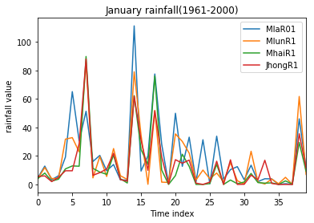
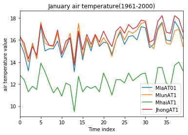
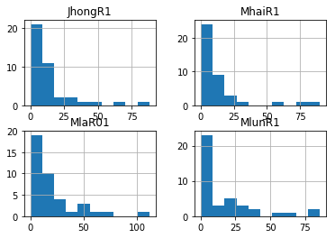
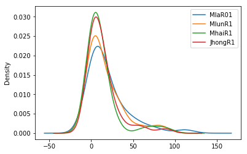
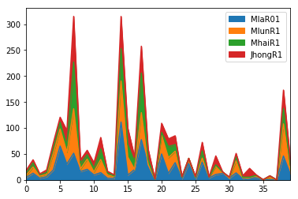
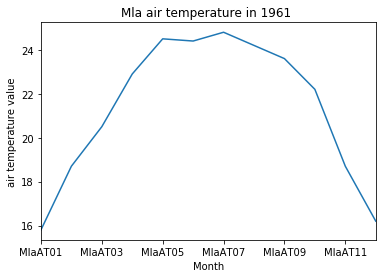

## Import 


```python
# necessary imports for the descriptive statistics
import pandas as pd
import matplotlib.pyplot as plt
%matplotlib inline
```

## General description

The following dataset is the rain and temperature data from January to December for the period of 1961-2000, which is from four county meteorological stations representing Mengla, Menglun, Menghai, Jinghong.

Variable tag description:

Mla=Mengla;  Mlun=Menglun;  Mhai=Menghai;  Jhong=Jinghong.

R=monthly rainfall; AT=monthly temperature; 01,02,...,12 means 12 months from January through December.


```python
import pandas as pd
df=pd.read_csv('C:/Users/Administrator/Desktop/Python/exercise/WeatherData(1961-2000)/Rain and Temperature Data(40 years).csv',header=0)
df.head()
```


<div>
<table border="1" class="dataframe">
  <thead>
    <tr style="text-align: right;">
      <th></th>
      <th>MlaR01</th>
      <th>MlaR02</th>
      <th>MlaR03</th>
      <th>MlaR04</th>
      <th>MlaR05</th>
      <th>MlaR06</th>
      <th>MlaR07</th>
      <th>MlaR08</th>
      <th>MlaR09</th>
      <th>MlaR10</th>
      <th>...</th>
      <th>JhongAT3</th>
      <th>JhongAT4</th>
      <th>JhongAT5</th>
      <th>JhongAT6</th>
      <th>JhongAT7</th>
      <th>JhongAT8</th>
      <th>JhongAT9</th>
      <th>JhongAT10</th>
      <th>JhongAT11</th>
      <th>JhongAT12</th>
    </tr>
  </thead>
  <tbody>
    <tr>
      <th>0</th>
      <td>4.8</td>
      <td>46.8</td>
      <td>41.4</td>
      <td>97.7</td>
      <td>262.8</td>
      <td>205.4</td>
      <td>215.5</td>
      <td>415.2</td>
      <td>245.1</td>
      <td>21.5</td>
      <td>...</td>
      <td>21.3</td>
      <td>24.2</td>
      <td>25.8</td>
      <td>26.0</td>
      <td>25.6</td>
      <td>24.8</td>
      <td>24.1</td>
      <td>22.9</td>
      <td>19.0</td>
      <td>16.7</td>
    </tr>
    <tr>
      <th>1</th>
      <td>12.9</td>
      <td>45.0</td>
      <td>16.8</td>
      <td>105.3</td>
      <td>166.0</td>
      <td>258.6</td>
      <td>91.0</td>
      <td>330.9</td>
      <td>93.0</td>
      <td>115.8</td>
      <td>...</td>
      <td>19.4</td>
      <td>24.4</td>
      <td>26.1</td>
      <td>25.1</td>
      <td>25.6</td>
      <td>24.5</td>
      <td>23.9</td>
      <td>22.1</td>
      <td>18.8</td>
      <td>15.4</td>
    </tr>
    <tr>
      <th>2</th>
      <td>3.3</td>
      <td>5.2</td>
      <td>42.0</td>
      <td>114.7</td>
      <td>90.0</td>
      <td>314.1</td>
      <td>363.8</td>
      <td>350.6</td>
      <td>72.9</td>
      <td>228.1</td>
      <td>...</td>
      <td>20.4</td>
      <td>24.0</td>
      <td>26.3</td>
      <td>25.9</td>
      <td>25.3</td>
      <td>24.6</td>
      <td>25.0</td>
      <td>22.0</td>
      <td>19.4</td>
      <td>15.4</td>
    </tr>
    <tr>
      <th>3</th>
      <td>6.1</td>
      <td>9.7</td>
      <td>46.5</td>
      <td>88.7</td>
      <td>125.4</td>
      <td>335.7</td>
      <td>448.6</td>
      <td>241.5</td>
      <td>104.6</td>
      <td>155.6</td>
      <td>...</td>
      <td>20.5</td>
      <td>23.7</td>
      <td>24.8</td>
      <td>25.1</td>
      <td>24.2</td>
      <td>24.9</td>
      <td>24.7</td>
      <td>23.3</td>
      <td>18.8</td>
      <td>15.1</td>
    </tr>
    <tr>
      <th>4</th>
      <td>19.2</td>
      <td>28.3</td>
      <td>19.8</td>
      <td>44.1</td>
      <td>176.2</td>
      <td>228.2</td>
      <td>340.3</td>
      <td>235.8</td>
      <td>194.2</td>
      <td>128.6</td>
      <td>...</td>
      <td>20.2</td>
      <td>24.3</td>
      <td>25.9</td>
      <td>25.3</td>
      <td>25.4</td>
      <td>24.3</td>
      <td>24.1</td>
      <td>22.2</td>
      <td>18.5</td>
      <td>17.4</td>
    </tr>
  </tbody>
</table>
<p>5 rows × 96 columns</p>
</div>


```python
df.shape
```


    (40, 96)


We can see that the index of the DataFrame consists of 40 rows representing 40 years(1961-2000), and there are 96 columns in the DataFrame, which consist of the rain and temperature data from January to December.


```python
df.index #examine the index
```


    RangeIndex(start=0, stop=40, step=1)


```python
df.columns #get the columns
```


    Index(['MlaR01', 'MlaR02', 'MlaR03', 'MlaR04', 'MlaR05', 'MlaR06', 'MlaR07',
           'MlaR08', 'MlaR09', 'MlaR10', 'MlaR11', 'MlaR12', 'MlaAT01', 'MlaAT02',
           'MlaAT03', 'MlaAT04', 'MlaAT05', 'MlaAT06', 'MlaAT07', 'MlaAT08',
           'MlaAT09', 'MlaAT10', 'MlaAT11', 'MlaAT12', 'MlunR1', 'MlunR2',
           'MlunR3', 'MlunR4', 'MlunR5', 'MlunR6', 'MlunR7', 'MlunR8', 'MlunR9',
           'MlunR10', 'MlunR11', 'MlunR12', 'MlunAT1', 'MlunAT2', 'MlunAT3',
           'MlunAT4', 'MlunAT5', 'MlunAT6', 'MlunAT7', 'MlunAT8', 'MlunAT9',
           'MlunAT10', 'MlunAT11', 'MlunAT12', 'MhaiR1', 'MhaiR2', 'MhaiR3',
           'MhaiR4', 'MhaiR5', 'MhaiR6', 'MhaiR7', 'MhaiR8', 'MhaiR9', 'MhaiR10',
           'MhaiR11', 'MhaiR12', 'MhaiAT1', 'MhaiAT2', 'MhaiAT3', 'MhaiAT4',
           'MhaiAT5', 'MhaiAT6', 'MhaiAT7', 'MhaiAT8', 'MhaiAT9', 'MhaiAT10',
           'MhaiAT11', 'MhaiAT12', 'JhongR1', 'JhongR2', 'JhongR3', 'JhongR4',
           'JhongR5', 'JhongR6', 'JhongR7', 'JhongR8', 'JhongR9', 'JhongR10',
           'JhongR11', 'JhongR12', 'JhongAT1', 'JhongAT2', 'JhongAT3', 'JhongAT4',
           'JhongAT5', 'JhongAT6', 'JhongAT7', 'JhongAT8', 'JhongAT9', 'JhongAT10',
           'JhongAT11', 'JhongAT12'],
          dtype='object')


    


```python
df.head() #peek at the first 5 rows of the data using the .head() method
```


<div>
<table border="1" class="dataframe">
  <thead>
    <tr style="text-align: right;">
      <th></th>
      <th>MlaR01</th>
      <th>MlaR02</th>
      <th>MlaR03</th>
      <th>MlaR04</th>
      <th>MlaR05</th>
      <th>MlaR06</th>
      <th>MlaR07</th>
      <th>MlaR08</th>
      <th>MlaR09</th>
      <th>MlaR10</th>
      <th>...</th>
      <th>JhongAT3</th>
      <th>JhongAT4</th>
      <th>JhongAT5</th>
      <th>JhongAT6</th>
      <th>JhongAT7</th>
      <th>JhongAT8</th>
      <th>JhongAT9</th>
      <th>JhongAT10</th>
      <th>JhongAT11</th>
      <th>JhongAT12</th>
    </tr>
  </thead>
  <tbody>
    <tr>
      <th>0</th>
      <td>4.8</td>
      <td>46.8</td>
      <td>41.4</td>
      <td>97.7</td>
      <td>262.8</td>
      <td>205.4</td>
      <td>215.5</td>
      <td>415.2</td>
      <td>245.1</td>
      <td>21.5</td>
      <td>...</td>
      <td>21.3</td>
      <td>24.2</td>
      <td>25.8</td>
      <td>26.0</td>
      <td>25.6</td>
      <td>24.8</td>
      <td>24.1</td>
      <td>22.9</td>
      <td>19.0</td>
      <td>16.7</td>
    </tr>
    <tr>
      <th>1</th>
      <td>12.9</td>
      <td>45.0</td>
      <td>16.8</td>
      <td>105.3</td>
      <td>166.0</td>
      <td>258.6</td>
      <td>91.0</td>
      <td>330.9</td>
      <td>93.0</td>
      <td>115.8</td>
      <td>...</td>
      <td>19.4</td>
      <td>24.4</td>
      <td>26.1</td>
      <td>25.1</td>
      <td>25.6</td>
      <td>24.5</td>
      <td>23.9</td>
      <td>22.1</td>
      <td>18.8</td>
      <td>15.4</td>
    </tr>
    <tr>
      <th>2</th>
      <td>3.3</td>
      <td>5.2</td>
      <td>42.0</td>
      <td>114.7</td>
      <td>90.0</td>
      <td>314.1</td>
      <td>363.8</td>
      <td>350.6</td>
      <td>72.9</td>
      <td>228.1</td>
      <td>...</td>
      <td>20.4</td>
      <td>24.0</td>
      <td>26.3</td>
      <td>25.9</td>
      <td>25.3</td>
      <td>24.6</td>
      <td>25.0</td>
      <td>22.0</td>
      <td>19.4</td>
      <td>15.4</td>
    </tr>
    <tr>
      <th>3</th>
      <td>6.1</td>
      <td>9.7</td>
      <td>46.5</td>
      <td>88.7</td>
      <td>125.4</td>
      <td>335.7</td>
      <td>448.6</td>
      <td>241.5</td>
      <td>104.6</td>
      <td>155.6</td>
      <td>...</td>
      <td>20.5</td>
      <td>23.7</td>
      <td>24.8</td>
      <td>25.1</td>
      <td>24.2</td>
      <td>24.9</td>
      <td>24.7</td>
      <td>23.3</td>
      <td>18.8</td>
      <td>15.1</td>
    </tr>
    <tr>
      <th>4</th>
      <td>19.2</td>
      <td>28.3</td>
      <td>19.8</td>
      <td>44.1</td>
      <td>176.2</td>
      <td>228.2</td>
      <td>340.3</td>
      <td>235.8</td>
      <td>194.2</td>
      <td>128.6</td>
      <td>...</td>
      <td>20.2</td>
      <td>24.3</td>
      <td>25.9</td>
      <td>25.3</td>
      <td>25.4</td>
      <td>24.3</td>
      <td>24.1</td>
      <td>22.2</td>
      <td>18.5</td>
      <td>17.4</td>
    </tr>
  </tbody>
</table>
<p>5 rows × 96 columns</p>
</div>


The first 5 rows representing the rain and air temperature monthly data from the 4 count meteorological stations for the period of 1961-1965.
Likewise, the last 5 rows representing the data for the period of 1996-2000.


```python
df.tail() #peek at the last 5 rows of the data using the .tail() method
```


<div>
<table border="1" class="dataframe">
  <thead>
    <tr style="text-align: right;">
      <th></th>
      <th>MlaR01</th>
      <th>MlaR02</th>
      <th>MlaR03</th>
      <th>MlaR04</th>
      <th>MlaR05</th>
      <th>MlaR06</th>
      <th>MlaR07</th>
      <th>MlaR08</th>
      <th>MlaR09</th>
      <th>MlaR10</th>
      <th>...</th>
      <th>JhongAT3</th>
      <th>JhongAT4</th>
      <th>JhongAT5</th>
      <th>JhongAT6</th>
      <th>JhongAT7</th>
      <th>JhongAT8</th>
      <th>JhongAT9</th>
      <th>JhongAT10</th>
      <th>JhongAT11</th>
      <th>JhongAT12</th>
    </tr>
  </thead>
  <tbody>
    <tr>
      <th>35</th>
      <td>0.0</td>
      <td>41.5</td>
      <td>72.7</td>
      <td>67.0</td>
      <td>153.0</td>
      <td>137.8</td>
      <td>354.4</td>
      <td>316.5</td>
      <td>134.5</td>
      <td>74.3</td>
      <td>...</td>
      <td>22.6</td>
      <td>24.5</td>
      <td>26.0</td>
      <td>26.0</td>
      <td>25.3</td>
      <td>25.4</td>
      <td>25.2</td>
      <td>23.0</td>
      <td>21.2</td>
      <td>18.3</td>
    </tr>
    <tr>
      <th>36</th>
      <td>0.5</td>
      <td>0.0</td>
      <td>63.8</td>
      <td>122.5</td>
      <td>29.6</td>
      <td>107.9</td>
      <td>547.8</td>
      <td>186.1</td>
      <td>273.2</td>
      <td>56.3</td>
      <td>...</td>
      <td>22.4</td>
      <td>23.0</td>
      <td>26.9</td>
      <td>26.6</td>
      <td>25.7</td>
      <td>26.0</td>
      <td>24.0</td>
      <td>23.4</td>
      <td>20.5</td>
      <td>19.4</td>
    </tr>
    <tr>
      <th>37</th>
      <td>0.0</td>
      <td>4.5</td>
      <td>30.2</td>
      <td>183.2</td>
      <td>176.7</td>
      <td>103.0</td>
      <td>351.3</td>
      <td>184.3</td>
      <td>127.2</td>
      <td>61.3</td>
      <td>...</td>
      <td>22.7</td>
      <td>24.2</td>
      <td>26.3</td>
      <td>26.8</td>
      <td>25.4</td>
      <td>25.6</td>
      <td>24.9</td>
      <td>23.6</td>
      <td>20.2</td>
      <td>18.2</td>
    </tr>
    <tr>
      <th>38</th>
      <td>46.1</td>
      <td>0.1</td>
      <td>61.1</td>
      <td>79.4</td>
      <td>182.9</td>
      <td>305.3</td>
      <td>179.2</td>
      <td>281.0</td>
      <td>211.3</td>
      <td>74.0</td>
      <td>...</td>
      <td>22.0</td>
      <td>25.8</td>
      <td>24.4</td>
      <td>26.5</td>
      <td>25.7</td>
      <td>25.3</td>
      <td>24.8</td>
      <td>23.4</td>
      <td>19.7</td>
      <td>14.6</td>
    </tr>
    <tr>
      <th>39</th>
      <td>11.8</td>
      <td>42.5</td>
      <td>79.9</td>
      <td>85.4</td>
      <td>241.3</td>
      <td>242.9</td>
      <td>390.7</td>
      <td>388.4</td>
      <td>221.3</td>
      <td>213.5</td>
      <td>...</td>
      <td>20.6</td>
      <td>24.6</td>
      <td>24.2</td>
      <td>25.7</td>
      <td>25.7</td>
      <td>25.8</td>
      <td>24.4</td>
      <td>23.6</td>
      <td>19.3</td>
      <td>18.6</td>
    </tr>
  </tbody>
</table>
<p>5 rows × 96 columns</p>
</div>


## Summary statistics

The following code returns summary statistics on the rain and temperature data, including the count of items that are not part of NaN; the mean and standard deviation; minimum and maximum values; and the values of the 25,50,and 75 percentiles:


```python
df.describe() # returns summary statistics
```


<div>
<table border="1" class="dataframe">
  <thead>
    <tr style="text-align: right;">
      <th></th>
      <th>MlaR01</th>
      <th>MlaR02</th>
      <th>MlaR03</th>
      <th>MlaR04</th>
      <th>MlaR05</th>
      <th>MlaR06</th>
      <th>MlaR07</th>
      <th>MlaR08</th>
      <th>MlaR09</th>
      <th>MlaR10</th>
      <th>...</th>
      <th>JhongAT3</th>
      <th>JhongAT4</th>
      <th>JhongAT5</th>
      <th>JhongAT6</th>
      <th>JhongAT7</th>
      <th>JhongAT8</th>
      <th>JhongAT9</th>
      <th>JhongAT10</th>
      <th>JhongAT11</th>
      <th>JhongAT12</th>
    </tr>
  </thead>
  <tbody>
    <tr>
      <th>count</th>
      <td>40.000000</td>
      <td>40.000000</td>
      <td>40.000000</td>
      <td>40.000000</td>
      <td>40.000000</td>
      <td>40.000000</td>
      <td>40.00000</td>
      <td>40.000000</td>
      <td>40.000000</td>
      <td>40.000000</td>
      <td>...</td>
      <td>40.000000</td>
      <td>40.000000</td>
      <td>40.0000</td>
      <td>40.00000</td>
      <td>40.000000</td>
      <td>40.00000</td>
      <td>40.000000</td>
      <td>40.00000</td>
      <td>40.000000</td>
      <td>40.000000</td>
    </tr>
    <tr>
      <th>mean</th>
      <td>19.562500</td>
      <td>22.697500</td>
      <td>37.550000</td>
      <td>96.352500</td>
      <td>167.657500</td>
      <td>225.680000</td>
      <td>303.86000</td>
      <td>308.070000</td>
      <td>158.290000</td>
      <td>93.927500</td>
      <td>...</td>
      <td>21.477500</td>
      <td>24.377500</td>
      <td>25.7775</td>
      <td>25.91500</td>
      <td>25.507500</td>
      <td>25.22000</td>
      <td>24.600000</td>
      <td>22.79750</td>
      <td>19.622500</td>
      <td>16.472500</td>
    </tr>
    <tr>
      <th>std</th>
      <td>24.024557</td>
      <td>24.924578</td>
      <td>28.946662</td>
      <td>45.086094</td>
      <td>69.049926</td>
      <td>76.860133</td>
      <td>100.31874</td>
      <td>90.486716</td>
      <td>72.134205</td>
      <td>52.928239</td>
      <td>...</td>
      <td>0.881283</td>
      <td>1.041323</td>
      <td>0.8980</td>
      <td>0.59938</td>
      <td>0.460984</td>
      <td>0.52242</td>
      <td>0.458537</td>
      <td>0.74644</td>
      <td>0.914691</td>
      <td>1.201706</td>
    </tr>
    <tr>
      <th>min</th>
      <td>0.000000</td>
      <td>0.000000</td>
      <td>0.000000</td>
      <td>25.700000</td>
      <td>29.600000</td>
      <td>103.000000</td>
      <td>91.00000</td>
      <td>173.800000</td>
      <td>40.300000</td>
      <td>13.300000</td>
      <td>...</td>
      <td>19.400000</td>
      <td>22.300000</td>
      <td>24.2000</td>
      <td>24.90000</td>
      <td>24.200000</td>
      <td>24.00000</td>
      <td>23.400000</td>
      <td>21.10000</td>
      <td>17.100000</td>
      <td>13.300000</td>
    </tr>
    <tr>
      <th>25%</th>
      <td>3.300000</td>
      <td>4.225000</td>
      <td>12.975000</td>
      <td>62.925000</td>
      <td>120.950000</td>
      <td>163.675000</td>
      <td>234.95000</td>
      <td>236.400000</td>
      <td>108.350000</td>
      <td>55.650000</td>
      <td>...</td>
      <td>20.700000</td>
      <td>23.800000</td>
      <td>25.1000</td>
      <td>25.37500</td>
      <td>25.300000</td>
      <td>24.97500</td>
      <td>24.300000</td>
      <td>22.27500</td>
      <td>19.000000</td>
      <td>15.625000</td>
    </tr>
    <tr>
      <th>50%</th>
      <td>12.150000</td>
      <td>11.900000</td>
      <td>34.000000</td>
      <td>91.250000</td>
      <td>170.950000</td>
      <td>219.900000</td>
      <td>291.80000</td>
      <td>302.350000</td>
      <td>140.350000</td>
      <td>84.600000</td>
      <td>...</td>
      <td>21.400000</td>
      <td>24.400000</td>
      <td>25.7000</td>
      <td>26.00000</td>
      <td>25.550000</td>
      <td>25.30000</td>
      <td>24.650000</td>
      <td>22.85000</td>
      <td>19.450000</td>
      <td>16.550000</td>
    </tr>
    <tr>
      <th>75%</th>
      <td>28.875000</td>
      <td>38.200000</td>
      <td>53.800000</td>
      <td>122.900000</td>
      <td>202.675000</td>
      <td>278.900000</td>
      <td>356.75000</td>
      <td>360.050000</td>
      <td>210.850000</td>
      <td>129.675000</td>
      <td>...</td>
      <td>22.100000</td>
      <td>24.925000</td>
      <td>26.3000</td>
      <td>26.30000</td>
      <td>25.725000</td>
      <td>25.60000</td>
      <td>24.900000</td>
      <td>23.40000</td>
      <td>20.200000</td>
      <td>17.125000</td>
    </tr>
    <tr>
      <th>max</th>
      <td>111.400000</td>
      <td>96.700000</td>
      <td>130.800000</td>
      <td>202.100000</td>
      <td>377.200000</td>
      <td>410.700000</td>
      <td>547.80000</td>
      <td>508.100000</td>
      <td>321.700000</td>
      <td>228.100000</td>
      <td>...</td>
      <td>23.400000</td>
      <td>26.800000</td>
      <td>27.7000</td>
      <td>27.20000</td>
      <td>26.700000</td>
      <td>26.40000</td>
      <td>25.500000</td>
      <td>24.10000</td>
      <td>21.400000</td>
      <td>19.400000</td>
    </tr>
  </tbody>
</table>
<p>8 rows × 96 columns</p>
</div>


```python
MlaRmin=df.min()
MlaRmin[0:12]
```


    MlaR01      0.0
    MlaR02      0.0
    MlaR03      0.0
    MlaR04     25.7
    MlaR05     29.6
    MlaR06    103.0
    MlaR07     91.0
    MlaR08    173.8
    MlaR09     40.3
    MlaR10     13.3
    MlaR11      0.0
    MlaR12      0.0
    dtype: float64


We can see that the smallest rainfall occurred in January, February, March, November and December within the 40 years in Mla.


```python
MlaATmin=df.min()
MlaATmin[12:24]
```


    MlaAT01    13.1
    MlaAT02    15.6
    MlaAT03    18.0
    MlaAT04    21.3
    MlaAT05    23.4
    MlaAT06    24.2
    MlaAT07    23.8
    MlaAT08    23.2
    MlaAT09    22.7
    MlaAT10    20.4
    MlaAT11    16.6
    MlaAT12    12.4
    dtype: float64


We can see that the temperature are lower than 20 degrees for 5 months, which also have the smallest rainfall.

## Selecting DataFrame

Selecting the rainfall data from January to December within 40 years in Mla:


```python
# rows and columns can be retrieved by location using .iloc[]
# get rows from 0 to 39, and columns from 0 to 12
MlaR=df.iloc[:40,0:12]
MlaR.head() # show the first 5 years' data
```


<div>
<table border="1" class="dataframe">
  <thead>
    <tr style="text-align: right;">
      <th></th>
      <th>MlaR01</th>
      <th>MlaR02</th>
      <th>MlaR03</th>
      <th>MlaR04</th>
      <th>MlaR05</th>
      <th>MlaR06</th>
      <th>MlaR07</th>
      <th>MlaR08</th>
      <th>MlaR09</th>
      <th>MlaR10</th>
      <th>MlaR11</th>
      <th>MlaR12</th>
    </tr>
  </thead>
  <tbody>
    <tr>
      <th>0</th>
      <td>4.8</td>
      <td>46.8</td>
      <td>41.4</td>
      <td>97.7</td>
      <td>262.8</td>
      <td>205.4</td>
      <td>215.5</td>
      <td>415.2</td>
      <td>245.1</td>
      <td>21.5</td>
      <td>47.9</td>
      <td>53.6</td>
    </tr>
    <tr>
      <th>1</th>
      <td>12.9</td>
      <td>45.0</td>
      <td>16.8</td>
      <td>105.3</td>
      <td>166.0</td>
      <td>258.6</td>
      <td>91.0</td>
      <td>330.9</td>
      <td>93.0</td>
      <td>115.8</td>
      <td>12.3</td>
      <td>5.4</td>
    </tr>
    <tr>
      <th>2</th>
      <td>3.3</td>
      <td>5.2</td>
      <td>42.0</td>
      <td>114.7</td>
      <td>90.0</td>
      <td>314.1</td>
      <td>363.8</td>
      <td>350.6</td>
      <td>72.9</td>
      <td>228.1</td>
      <td>101.9</td>
      <td>11.3</td>
    </tr>
    <tr>
      <th>3</th>
      <td>6.1</td>
      <td>9.7</td>
      <td>46.5</td>
      <td>88.7</td>
      <td>125.4</td>
      <td>335.7</td>
      <td>448.6</td>
      <td>241.5</td>
      <td>104.6</td>
      <td>155.6</td>
      <td>33.4</td>
      <td>47.1</td>
    </tr>
    <tr>
      <th>4</th>
      <td>19.2</td>
      <td>28.3</td>
      <td>19.8</td>
      <td>44.1</td>
      <td>176.2</td>
      <td>228.2</td>
      <td>340.3</td>
      <td>235.8</td>
      <td>194.2</td>
      <td>128.6</td>
      <td>140.2</td>
      <td>68.7</td>
    </tr>
  </tbody>
</table>
</div>


The following code returns summary statistics on the rainfall data from January to December within 40 years in Mla:


```python
MlaR.describe() # returns summary statistics
```


<div>
<table border="1" class="dataframe">
  <thead>
    <tr style="text-align: right;">
      <th></th>
      <th>MlaR01</th>
      <th>MlaR02</th>
      <th>MlaR03</th>
      <th>MlaR04</th>
      <th>MlaR05</th>
      <th>MlaR06</th>
      <th>MlaR07</th>
      <th>MlaR08</th>
      <th>MlaR09</th>
      <th>MlaR10</th>
      <th>MlaR11</th>
      <th>MlaR12</th>
    </tr>
  </thead>
  <tbody>
    <tr>
      <th>count</th>
      <td>40.000000</td>
      <td>40.000000</td>
      <td>40.000000</td>
      <td>40.000000</td>
      <td>40.000000</td>
      <td>40.000000</td>
      <td>40.00000</td>
      <td>40.000000</td>
      <td>40.000000</td>
      <td>40.000000</td>
      <td>40.000000</td>
      <td>40.000000</td>
    </tr>
    <tr>
      <th>mean</th>
      <td>19.562500</td>
      <td>22.697500</td>
      <td>37.550000</td>
      <td>96.352500</td>
      <td>167.657500</td>
      <td>225.680000</td>
      <td>303.86000</td>
      <td>308.070000</td>
      <td>158.290000</td>
      <td>93.927500</td>
      <td>54.047500</td>
      <td>29.542500</td>
    </tr>
    <tr>
      <th>std</th>
      <td>24.024557</td>
      <td>24.924578</td>
      <td>28.946662</td>
      <td>45.086094</td>
      <td>69.049926</td>
      <td>76.860133</td>
      <td>100.31874</td>
      <td>90.486716</td>
      <td>72.134205</td>
      <td>52.928239</td>
      <td>49.021225</td>
      <td>32.107527</td>
    </tr>
    <tr>
      <th>min</th>
      <td>0.000000</td>
      <td>0.000000</td>
      <td>0.000000</td>
      <td>25.700000</td>
      <td>29.600000</td>
      <td>103.000000</td>
      <td>91.00000</td>
      <td>173.800000</td>
      <td>40.300000</td>
      <td>13.300000</td>
      <td>0.000000</td>
      <td>0.000000</td>
    </tr>
    <tr>
      <th>25%</th>
      <td>3.300000</td>
      <td>4.225000</td>
      <td>12.975000</td>
      <td>62.925000</td>
      <td>120.950000</td>
      <td>163.675000</td>
      <td>234.95000</td>
      <td>236.400000</td>
      <td>108.350000</td>
      <td>55.650000</td>
      <td>19.700000</td>
      <td>4.275000</td>
    </tr>
    <tr>
      <th>50%</th>
      <td>12.150000</td>
      <td>11.900000</td>
      <td>34.000000</td>
      <td>91.250000</td>
      <td>170.950000</td>
      <td>219.900000</td>
      <td>291.80000</td>
      <td>302.350000</td>
      <td>140.350000</td>
      <td>84.600000</td>
      <td>41.500000</td>
      <td>17.850000</td>
    </tr>
    <tr>
      <th>75%</th>
      <td>28.875000</td>
      <td>38.200000</td>
      <td>53.800000</td>
      <td>122.900000</td>
      <td>202.675000</td>
      <td>278.900000</td>
      <td>356.75000</td>
      <td>360.050000</td>
      <td>210.850000</td>
      <td>129.675000</td>
      <td>76.475000</td>
      <td>47.175000</td>
    </tr>
    <tr>
      <th>max</th>
      <td>111.400000</td>
      <td>96.700000</td>
      <td>130.800000</td>
      <td>202.100000</td>
      <td>377.200000</td>
      <td>410.700000</td>
      <td>547.80000</td>
      <td>508.100000</td>
      <td>321.700000</td>
      <td>228.100000</td>
      <td>193.500000</td>
      <td>130.700000</td>
    </tr>
  </tbody>
</table>
</div>


The following example selects all line data whose index label is 4, performing the monthly rainfall data for 12 months in the year 1965:


```python
# using .ix() method to select rows by index label or location
MlaR1965=MlaR.ix[4]
MlaR1965
```


    MlaR01     19.2
    MlaR02     28.3
    MlaR03     19.8
    MlaR04     44.1
    MlaR05    176.2
    MlaR06    228.2
    MlaR07    340.3
    MlaR08    235.8
    MlaR09    194.2
    MlaR10    128.6
    MlaR11    140.2
    MlaR12     68.7
    Name: 4, dtype: float64


## Boolean selection

The following code demonstrates identifying items in a Series where the rainfall are greater than 200:


```python
# A Boolean selection applies a logical expression 
#to the value of the Series
MlaR1965>200
```


    MlaR01    False
    MlaR02    False
    MlaR03    False
    MlaR04    False
    MlaR05    False
    MlaR06     True
    MlaR07     True
    MlaR08     True
    MlaR09    False
    MlaR10    False
    MlaR11    False
    MlaR12    False
    Name: 4, dtype: bool


The following code extracts subsets whose values are greater than 200:


```python
# using the name of the Series inside of the [] operator 
# to extract subsets of data based on its contents:
MlaR1965[MlaR1965>200]
```


    MlaR06    228.2
    MlaR07    340.3
    MlaR08    235.8
    Name: 4, dtype: float64


We can see that the rainfall values in June, July and August are great than 200.

The following code extracts subsets whose values are greater than 100 and less than 200:


```python
MlaR1965[(MlaR1965>100)&(MlaR1965<200)]
```


    MlaR05    176.2
    MlaR09    194.2
    MlaR10    128.6
    MlaR11    140.2
    Name: 4, dtype: float64


It is convenient for us to see that the rainfall values in May, September, October and November are great than 100 and less than 200.

The following code extracts the air temperature monthly data in Mla in the year 1961: 


```python
# get row in location 1, and columns from 12 to 24
MlaAT1961=df.iloc[:1,12:24]
MlaAT1961
```


<div>
<table border="1" class="dataframe">
  <thead>
    <tr style="text-align: right;">
      <th></th>
      <th>MlaAT01</th>
      <th>MlaAT02</th>
      <th>MlaAT03</th>
      <th>MlaAT04</th>
      <th>MlaAT05</th>
      <th>MlaAT06</th>
      <th>MlaAT07</th>
      <th>MlaAT08</th>
      <th>MlaAT09</th>
      <th>MlaAT10</th>
      <th>MlaAT11</th>
      <th>MlaAT12</th>
    </tr>
  </thead>
  <tbody>
    <tr>
      <th>0</th>
      <td>15.8</td>
      <td>18.7</td>
      <td>20.5</td>
      <td>22.9</td>
      <td>24.5</td>
      <td>24.4</td>
      <td>24.8</td>
      <td>24.2</td>
      <td>23.6</td>
      <td>22.2</td>
      <td>18.7</td>
      <td>16.2</td>
    </tr>
  </tbody>
</table>
</div>


```python
# acquire the mean of the series
MlaAT1961.ix[0].mean()
```


    21.375


We can see the annual air temperature value is 21.375 degree in the year 1961.

Taking the rainfall data of the four places in January within 40 years as an example, I want to do some summary statistics and make further comparisons. The codes are as follows:


```python
# or type: df[[0,24,48,72]]
# to look up the rows with special index labels
dfR1=df[['MlaR01','MlunR1','MhaiR1','JhongR1']]
dfR1
```


<div>
<table border="1" class="dataframe">
  <thead>
    <tr style="text-align: right;">
      <th></th>
      <th>MlaR01</th>
      <th>MlunR1</th>
      <th>MhaiR1</th>
      <th>JhongR1</th>
    </tr>
  </thead>
  <tbody>
    <tr>
      <th>0</th>
      <td>4.8</td>
      <td>4.2</td>
      <td>4.2</td>
      <td>5.6</td>
    </tr>
    <tr>
      <th>1</th>
      <td>12.9</td>
      <td>11.9</td>
      <td>8.0</td>
      <td>6.0</td>
    </tr>
    <tr>
      <th>2</th>
      <td>3.3</td>
      <td>4.1</td>
      <td>2.3</td>
      <td>2.0</td>
    </tr>
    <tr>
      <th>3</th>
      <td>6.1</td>
      <td>4.3</td>
      <td>3.7</td>
      <td>5.0</td>
    </tr>
    <tr>
      <th>4</th>
      <td>19.2</td>
      <td>31.8</td>
      <td>10.9</td>
      <td>9.6</td>
    </tr>
    <tr>
      <th>5</th>
      <td>65.2</td>
      <td>32.9</td>
      <td>13.0</td>
      <td>9.6</td>
    </tr>
    <tr>
      <th>6</th>
      <td>30.6</td>
      <td>22.8</td>
      <td>12.8</td>
      <td>28.7</td>
    </tr>
    <tr>
      <th>7</th>
      <td>51.4</td>
      <td>85.6</td>
      <td>89.9</td>
      <td>88.1</td>
    </tr>
    <tr>
      <th>8</th>
      <td>16.1</td>
      <td>4.6</td>
      <td>11.3</td>
      <td>6.4</td>
    </tr>
    <tr>
      <th>9</th>
      <td>20.4</td>
      <td>19.6</td>
      <td>8.7</td>
      <td>8.3</td>
    </tr>
    <tr>
      <th>10</th>
      <td>9.6</td>
      <td>5.6</td>
      <td>7.1</td>
      <td>10.8</td>
    </tr>
    <tr>
      <th>11</th>
      <td>14.0</td>
      <td>25.2</td>
      <td>20.6</td>
      <td>21.9</td>
    </tr>
    <tr>
      <th>12</th>
      <td>3.2</td>
      <td>6.1</td>
      <td>4.0</td>
      <td>3.4</td>
    </tr>
    <tr>
      <th>13</th>
      <td>3.0</td>
      <td>3.5</td>
      <td>1.0</td>
      <td>2.3</td>
    </tr>
    <tr>
      <th>14</th>
      <td>111.4</td>
      <td>79.1</td>
      <td>62.4</td>
      <td>62.0</td>
    </tr>
    <tr>
      <th>15</th>
      <td>9.4</td>
      <td>34.7</td>
      <td>24.5</td>
      <td>31.0</td>
    </tr>
    <tr>
      <th>16</th>
      <td>20.1</td>
      <td>0.1</td>
      <td>14.1</td>
      <td>9.9</td>
    </tr>
    <tr>
      <th>17</th>
      <td>77.6</td>
      <td>52.0</td>
      <td>76.2</td>
      <td>51.7</td>
    </tr>
    <tr>
      <th>18</th>
      <td>28.3</td>
      <td>1.6</td>
      <td>10.1</td>
      <td>19.4</td>
    </tr>
    <tr>
      <th>19</th>
      <td>0.5</td>
      <td>1.4</td>
      <td>0.0</td>
      <td>0.3</td>
    </tr>
    <tr>
      <th>20</th>
      <td>50.0</td>
      <td>35.5</td>
      <td>6.2</td>
      <td>17.4</td>
    </tr>
    <tr>
      <th>21</th>
      <td>12.7</td>
      <td>30.2</td>
      <td>21.2</td>
      <td>14.9</td>
    </tr>
    <tr>
      <th>22</th>
      <td>33.2</td>
      <td>22.0</td>
      <td>12.7</td>
      <td>17.1</td>
    </tr>
    <tr>
      <th>23</th>
      <td>2.0</td>
      <td>3.2</td>
      <td>0.0</td>
      <td>0.9</td>
    </tr>
    <tr>
      <th>24</th>
      <td>31.4</td>
      <td>10.1</td>
      <td>0.0</td>
      <td>0.0</td>
    </tr>
    <tr>
      <th>25</th>
      <td>0.5</td>
      <td>4.0</td>
      <td>0.6</td>
      <td>1.6</td>
    </tr>
    <tr>
      <th>26</th>
      <td>33.9</td>
      <td>8.0</td>
      <td>14.1</td>
      <td>16.3</td>
    </tr>
    <tr>
      <th>27</th>
      <td>3.7</td>
      <td>1.9</td>
      <td>0.0</td>
      <td>0.0</td>
    </tr>
    <tr>
      <th>28</th>
      <td>10.4</td>
      <td>15.4</td>
      <td>3.1</td>
      <td>17.3</td>
    </tr>
    <tr>
      <th>29</th>
      <td>12.5</td>
      <td>2.6</td>
      <td>0.5</td>
      <td>0.0</td>
    </tr>
    <tr>
      <th>30</th>
      <td>3.3</td>
      <td>0.3</td>
      <td>1.7</td>
      <td>0.1</td>
    </tr>
    <tr>
      <th>31</th>
      <td>13.5</td>
      <td>23.3</td>
      <td>7.7</td>
      <td>6.5</td>
    </tr>
    <tr>
      <th>32</th>
      <td>2.0</td>
      <td>1.7</td>
      <td>1.3</td>
      <td>3.3</td>
    </tr>
    <tr>
      <th>33</th>
      <td>4.0</td>
      <td>0.3</td>
      <td>0.9</td>
      <td>17.0</td>
    </tr>
    <tr>
      <th>34</th>
      <td>3.9</td>
      <td>3.8</td>
      <td>1.1</td>
      <td>0.7</td>
    </tr>
    <tr>
      <th>35</th>
      <td>0.0</td>
      <td>0.5</td>
      <td>0.0</td>
      <td>0.0</td>
    </tr>
    <tr>
      <th>36</th>
      <td>0.5</td>
      <td>5.0</td>
      <td>2.5</td>
      <td>0.0</td>
    </tr>
    <tr>
      <th>37</th>
      <td>0.0</td>
      <td>0.0</td>
      <td>0.2</td>
      <td>0.0</td>
    </tr>
    <tr>
      <th>38</th>
      <td>46.1</td>
      <td>61.8</td>
      <td>29.5</td>
      <td>35.6</td>
    </tr>
    <tr>
      <th>39</th>
      <td>11.8</td>
      <td>7.0</td>
      <td>9.2</td>
      <td>11.6</td>
    </tr>
  </tbody>
</table>
</div>


```python
dfR1.describe()# returns summary statistics
```


<div>
<table border="1" class="dataframe">
  <thead>
    <tr style="text-align: right;">
      <th></th>
      <th>MlaR01</th>
      <th>MlunR1</th>
      <th>MhaiR1</th>
      <th>JhongR1</th>
    </tr>
  </thead>
  <tbody>
    <tr>
      <th>count</th>
      <td>40.000000</td>
      <td>40.000000</td>
      <td>40.000000</td>
      <td>40.000000</td>
    </tr>
    <tr>
      <th>mean</th>
      <td>19.562500</td>
      <td>16.692500</td>
      <td>12.432500</td>
      <td>13.557500</td>
    </tr>
    <tr>
      <th>std</th>
      <td>24.024557</td>
      <td>21.381988</td>
      <td>20.021327</td>
      <td>18.480161</td>
    </tr>
    <tr>
      <th>min</th>
      <td>0.000000</td>
      <td>0.000000</td>
      <td>0.000000</td>
      <td>0.000000</td>
    </tr>
    <tr>
      <th>25%</th>
      <td>3.300000</td>
      <td>3.050000</td>
      <td>1.075000</td>
      <td>1.425000</td>
    </tr>
    <tr>
      <th>50%</th>
      <td>12.150000</td>
      <td>5.850000</td>
      <td>6.650000</td>
      <td>7.400000</td>
    </tr>
    <tr>
      <th>75%</th>
      <td>28.875000</td>
      <td>23.775000</td>
      <td>12.850000</td>
      <td>17.150000</td>
    </tr>
    <tr>
      <th>max</th>
      <td>111.400000</td>
      <td>85.600000</td>
      <td>89.900000</td>
      <td>88.100000</td>
    </tr>
  </tbody>
</table>
</div>


We can see that for the period of 1961-2000, January rainfall in Mla is larger than the other three counties, and the degree of dispersion in which is the largest too.
In addition, the average rainfall in January is as low as 0 in the four counties.


```python
dfAT1=df[['MlaAT01','MlunAT1','MhaiAT1','JhongAT1']]
dfAT1.head()
```


<div>
<table border="1" class="dataframe">
  <thead>
    <tr style="text-align: right;">
      <th></th>
      <th>MlaAT01</th>
      <th>MlunAT1</th>
      <th>MhaiAT1</th>
      <th>JhongAT1</th>
    </tr>
  </thead>
  <tbody>
    <tr>
      <th>0</th>
      <td>15.8</td>
      <td>16.4</td>
      <td>12.8</td>
      <td>16.3</td>
    </tr>
    <tr>
      <th>1</th>
      <td>14.8</td>
      <td>15.3</td>
      <td>12.4</td>
      <td>15.7</td>
    </tr>
    <tr>
      <th>2</th>
      <td>13.2</td>
      <td>14.0</td>
      <td>11.3</td>
      <td>14.3</td>
    </tr>
    <tr>
      <th>3</th>
      <td>15.7</td>
      <td>15.7</td>
      <td>11.8</td>
      <td>15.4</td>
    </tr>
    <tr>
      <th>4</th>
      <td>14.3</td>
      <td>14.3</td>
      <td>11.5</td>
      <td>14.6</td>
    </tr>
  </tbody>
</table>
</div>


## Visualization

The .plot() method makes plots of pandas data very easy to create, and the .hist() method is useful for visualizing distributions of data. 


```python
dfR1.plot(title='January rainfall(1961-2000)')
plt.xlabel('Time index')
plt.ylabel('rainfall value')
```


    <matplotlib.text.Text at 0x89cc510>





The picture indicates that there are four peaks of rainfall from 1961 to 2000. 


```python
dfAT1.plot(title='January air temperature(1961-2000)')
plt.xlabel('Time index')
plt.ylabel('air temperature value')
```


    <matplotlib.text.Text at 0x89b2df0>





The picture indicates that January air temperature values in Mhai are lower than the others within 40 years, while the temperature values of the other three counties are close.

If the data has multiple series, the histogram function will automatically generate multiple histograma, one for each series:


```python
dfR1.hist()
```


    array([[<matplotlib.axes._subplots.AxesSubplot object at 0x08AAC0B0>,
            <matplotlib.axes._subplots.AxesSubplot object at 0x08AFAE90>],
           [<matplotlib.axes._subplots.AxesSubplot object at 0x08B3AF70>,
            <matplotlib.axes._subplots.AxesSubplot object at 0x08B716F0>]], dtype=object)





```python
# using the kind='kde' parameter to create kernel density estimation plots
dfR1.plot(kind='kde')
```


    <matplotlib.axes._subplots.AxesSubplot at 0x8bd95d0>





A kernel density estimate plot makes an attempt and estimates the true distribution of the data, and hence smoothes it into a continuous plot.


```python
# area plots are generated by specifying kind='area'
dfR1.plot(kind='area')
```


    <matplotlib.axes._subplots.AxesSubplot at 0x9314dd0>





```python
# plotting a DataFrame with a single row 
MlaAT1961.ix[0].plot(title='Mla air temperature in 1961 ')
plt.xlabel('Month')
plt.ylabel('air temperature value')
```


    <matplotlib.text.Text at 0x93ef3f0>





The picture indicates that Mla temperature in 1961 has began to fall continously from July.


```python

```


```python

```
